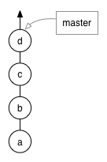
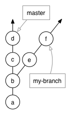
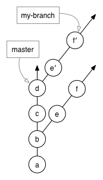

# How do I "squash" my commits?

## Why do I need to "squash"?

Squashing is important to reduce the number of commits that go into `develop` and keep the history simpler. 

Often a feature branch may include a number of large commits as well as a few smaller ones for minor edits (like spelling and formatting fixes). This is good: you should always commit often on your feature branch. However, once everything has been hashed out and your pull request has been approved, we do not necessarily need the history of ever commit and it's respective message. For this reason, we like to "squash" our commits into one before merging a pull request. 

The process of "squashing" your commits is done through a rebase.

## What is a rebase?

With large projects (such as ours), there are many different people working simultaneously. After submitting a pull request, chances are that someone else's pull request will be merged into `develop` before your pull request, resulting in your feature branch being behind. When this happens, your branch goes "stale" and needs to be revitalized through a rebase. While stale, conflicts may occur if someone also edited a line you edited.

Understanding how a rebase works requires some knowledge of how Git works.



To understand this, we need to understand a bit about how Git works. A Git repository is a tree structure, where the nodes of the tree are commits. Here's an example of a very simple repository: it has four commits on the master branch, and each commit has an ID (in this case, `a`, `b`, `c`, and `d`). You'll notice that `d` is currently the latest commit (or HEAD) of the `master` branch.



Here, we have two branches: `master` and `my-branch`. You can see that `master` and `my-branch` both contain commits `a` and `b`, but then they start to diverge: `master` contains `c` and `d`, while `my-branch` contains `e` and `f`. `b` is said to be the "merge base" of `my-branch` in comparison to `master` -- or more commonly, just the "base". It makes sense: you can see that `my-branch` was based on a previous version of `master`.

So let's say that `my-branch` has gone stale, and you want to bring it up to date with the latest version of `master`. To put it another way, `my-branch` needs to contain `c` and `d`. You could do a merge, but that causes the branch to contain weird merge commits that make reviewing the pull request much more difficult. Instead, you can do a [rebase](http://www.git-scm.com/book/en/Git-Branching-Rebasing).



When you rebase, Git finds the base of your branch (in this case, `b`), finds all the commits between that base and HEAD (in this case, `e` and `f`), and *re-plays* those commits on the HEAD of the branch you're rebasing onto (in this case, `master`). Git actually creates *new commits* that represent what your changes look like *on top of* `master`: in the diagram, these commits are called `e′` and `f′`. Git doesn't erase your previous commits: `e` and `f` are left untouched, and if something goes wrong with the rebase, you can go right back to the way things used to be.

Another thing to notice, however, is that Git treats branches as merely labels. The `master` branch is whatever commit the `master` label is pointing to, as well as all of that commit's parents. When you rebase a branch, Git moves the branch label to point at the newly-created commits: `my-branch` is no longer pointing at `f`, it's now pointing at `f′`. Going back to the way things used to be just consists of changing that branch label so that it points back at `f`.

You'll notice that there is not a direct path from `f` to `f′`: from the point of view of anyone else watching `my-branch`, history has suddenly changed. In effect, `c` and `d` have been injected into `my-branch`'s history, as if they had been there the entire time. Unlike most version control systems, Git allows you to change the history of your project -- but it is very cautious about letting you do so.

*The above section was adapted from [EdX's rebase guide](https://github.com/edx/edx-platform/wiki/How-to-Rebase-a-Pull-Request)*

Now that we've discussed how a rebase works, let's actually make it happen!

## Associating your favorite text editor with git

Before you start, [make sure your text editor is associated with Git](https://help.github.com/articles/associating-text-editors-with-git/).

### Wait! My editor wasn't listed...

That's okay! There are plenty of editors that support this functionality. Of course, if you don't want to choose a default you can always just use `vi`, the default, without making any changes. 

A few other popular editors:

- **Visual Studio Code:** type `git config --global core.editor "code --wait"` into your terminal

- **Vim:** type `git config --global core.editor "vim"` into your terminal

- Other command line-based editors can be added the same way vim is added: that includes nano, emacs, and more.

Is your editor still not listed? Stack Overflow will likely have the answer. [Here is a thread to get you started](http://stackoverflow.com/questions/2596805/how-do-i-make-git-use-the-editor-of-my-choice-for-commits)

Some editors require some sort of `--wait` operator. Without it, git may try and proceed before you've made any edits to the rebase. If you are seeing weird behavior with your editor while attempting to rebase, that may be the problem.

## Rebase

First, update your refs to be sure you have the latest code:

```shell
 git fetch --all
```

Next is the actual rebase. Depending on how you are working with the repo, this step may be different.

If you are working from a forked copy on a branch other than develop (i.e. you created a feature branch) run:

```shell
git rebase -i develop
```

If you are working from a forked copy on the develop branch run:

```shell
git rebase -i HEAD~n
```

With `n` being the number of commits you have added. Unsure of how many commits you've added? Check out the [`log` command.](https://www.git-scm.com/docs/git-log)

If you are working from the main repo run:

```shell
git rebase -i origin/develop
```

This says to rebase your work onto `develop` *from* the main repository.

## Squash

From here, you'll see something like the following in your text editor:

```text
pick f48d47c The first commit I did
pick fd4e046 The second commit I did
```

You'll want to change everything after your first commit from `pick` to `squash`. This tells git you want to squash these commits into the first one. Save and close the file.

From here, you'll get an editor that will let you change the commit messages.

```text
# This is a combination of 2 commits.
# The first commit's message is:
The first commit I did

# This is the 2nd commit message:

The second commit I did
```

You'll want to remove or comment out everything except for the first message, which you can edit to be a more complete summary of your changes. Once again, save and close teh file.

To finish, you'll force push this new commit with the following command:

```shell
git push origin [my-feature-branch] --force-with-lease
```

The `--force-with-lease` flag will refuse to update a branch if someone else has updated it upstream, making your force push a little safer.
